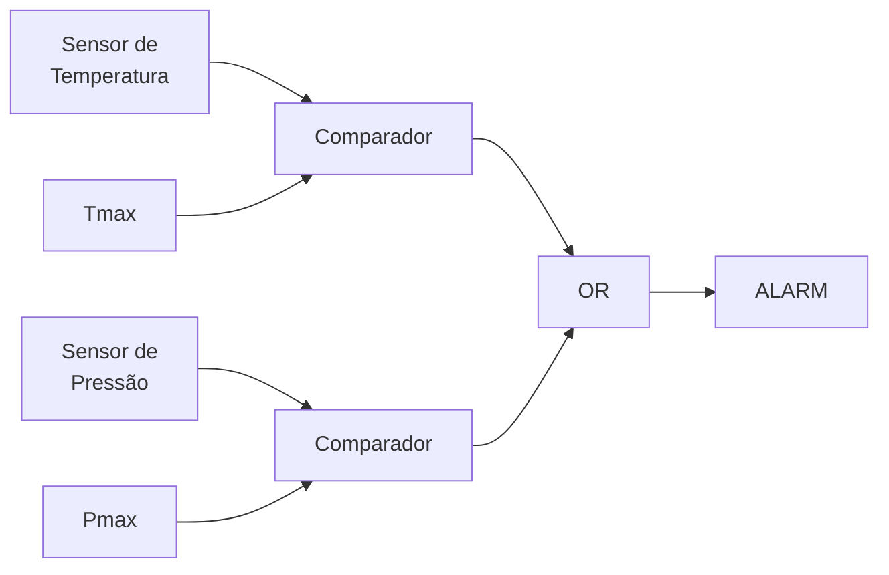

# {{ $slidev.configs.title }}
Introdução a Programação

---

# Objetivo de Aprendizagem
- Compreender os conceitos elementares da Álgebra de *Boole*

---

# Agenda
- Álgebra de dois valores
- Tabela verdade
- Operadores AND (E) e OR (OU)


---
layout: section
---

# Álgebra de Dois Valores <MarkerPattern />

---
layout: quote
---

> Define-se como Álgebra de *Boole* (ou Booleana) um conjunto de operadores que são assumidos como válidos sem necessidade de prova.

---
layout: default
---

# Características AB

- As variáveis assumem um número finito de valores constantes
  - Em números reais as variáveis podem assumir valores de $+\infty$ a $-\infty$
- Variáveis booleanas podem assumir dois valores
  - [F, V]
  - [H, L] (*High* ou *Low*)
  - [On, Off]
  - [Acesso, Apagado]
  - [Certo, Errado]
- **O que há em comum com esses valores?**

---
layout: default
---

# Funções Reais

- Considere como exemplo a função $f(x) = x + 5$
- Como poderíamos representar todos os valores dessa função?

---
layout: default
---

# Gráfico

|  $x$ | $f(x)$ |
|:--:|:----:|
| -5 |   0  |
|  0 |   5  |
|  5 |  10  |

---

```mermaid
xychart-beta
    title "f(x) = x + 5"
    x-axis "x" 0 --> 10 
    y-axis "y" 0 --> 10
    line [0, 5, 10]
```

---

# Tabela Verdade

- O número de estados que uma função booleana pode assumir é **finito**
- Pode-se descrever **completamente** uma função booleana utilizando tabelas
- Uma Tabela Verdade (TV) lista os valores de entrada que as variáveis podem assumir e o valor de saída da função

---

# Exemplo de Tabela Verdade

|  **A** | **B**    | **S**   |
|:--:|:----:|:---:|
| 0   |   0  | 0 |
|  0  |   1  | 1 |
|  1  |  0   | 1 |
|  1  | 1    | 0 |

---
layout: section
---

# Operadores Elementares

---

# Operadores

- Funções booleanas ou Operadores
  - **OR** (OU, $+$)
  - **AND** (E, $\cdot$)
  - **NOT** (Negação, Complemento, ~)


---
layout: quote
---

> A operação **OR** resulta 1 se pelo menos uma das variáveis de entrada vale 1. Também conhecida como adição lógica.

---

# OR

| $0 + 0$ |   =  |  ? |
|:--:|:----:|:---:|
|  $0+1$  |   =  | ? |
|  $1+0$  |   =  | ? |
|  $1+1$  |   =  |  ? |

---
layout: default
---

# OR

| $0 + 0$ |   =  | 0 |
|:--:|:----:|:---:|
|  $0+1$  |   =  | 1 |
|  $1+0$  |   =  | 1 |
|  $1+1$  |   =  | 1 |

---
layout: default
---

# Tabela Verdade OR

| **A**|**B**|**OR**|
|:--:|:----:|:---:|
| 0   |   0  | 0 |
|  0  |   1  | 1 |
|  1  |   0  | 1 |
|  1  |   1  | 1 |


---
layout: default
---

# Características OR

- Operador binário
- Apenas um **ÚNICO** valor 1 na entrada faz com que a saída seja 1
- Somente com **TODOS** os valores de entrada 0 a saída será 0

---
layout: quote
---

> A operação **AND** resulta 0 se pelo menos uma das variáveis de entrada valer 0. Também conhecida como multiplicação lógica


---
layout: default
---

# AND

| $0 + 0$ |   =  | ? |
|:--:|:----:|:---:|
|  $0+1$  |   =  | ? |
|  $1+0$  |   =  | ? |
|  $1+1$  |   =  | ? |

---
layout: default
---

# AND

| $0 + 0$ |   =  | 0 |
|:--:|:----:|:---:|
|  $0+1$  |   =  | 0 |
|  $1+0$  |   =  | 0 |
|  $1+1$  |   =  | 1 |

---

# Tabela Verdade AND

| **A**|**B**|**AND**|
|:--:|:----:|:---:|
| 0   |   0  | 0 |
|  0  |   1  | 0 |
|  1  |   0  | 0 |
|  1  |   1  | 1 |


---

# Características AND

- Operador binário
- Apenas um **UMA** entrada com valor 0 faz com que a saída seja 0
- Somente com **TODOS** os valores de entrada 1 a saída será 1

---
layout: quote
---

> A operação NOT tem como resultado o valor complementar ao que a variável apresenta. Também chamado de Negação, Inversão ou Complementação.

---
layout: default
---

# NOT

| $\overline{0}$ |   =  | ? |
|:--:|:----:|:---:|
|  $\overline{1}$  |   =  | ? |

---
layout: default
---

# NOT

| $\overline{0}$ |   =  | 1 |
|:--:|:----:|:---:|
|  $\overline{1}$  |   =  | 0 |

---

# Tabela Verdade NOT

| **A**|$\overline{A}$|
|:--:|:---:|
| 1   |   0  |
|  0  |   1  |


---

# Características NOT

- Operador unário
- Definida para uma variável apenas

---
layout: section
---

# Expressões Booleanas

---
layout: quote
---

> Uma expressão ou função booleana é uma combinação de operadores e variáveis que resultam em um valor booleano (ou lógico).

---
layout: fact
---

# $W = X + Y \cdot \overline{Z}$

---
layout: two-cols-header
---

# Exemplo

::left::

- Quais as variáveis de entrada?
- Quantas linhas são necessárias para escrever a TV?
- Qual a precedência entre as operações?

::right::

$W = X + Y \cdot \overline{Z}$

---

# Quais as variáveis de entrada?

> A variável de saída $W$ é expressa como uma função de 3 variáveis de entrada, $X$, $Y$ e $Z$

---

# Quantas linhas são necessárias na TV?

::left::

> Se temos 3 variáveis de entrada, existem $2^3$ combinações possíveis dos valores, logo a TV contém 8 linhas.

::right::

$W = X + Y \cdot \overline{Z}$


---
layout: default
---

# Qual a precedência entre as operações?

::left::

- Assim como nas expressões algébricas, nas booleanas há precedência nas operações da seguinte forma:
  - AND
  - OR
  - NOT (Assim que possível)

::right::

$W = X + Y \cdot \overline{Z}$

---
layout: full
---

# $W = X + Y \cdot \overline{Z}$

| **$X$** | **$Y$** | **$Z$** | **$\overline{Z}$** | **$Y \cdot \overline{Z}$** | **$W$** |
|:-------:|:-------:|:-------:|:------------------:|:--------------------------:|:-------:|
|   |   |   |               |                      |   |
|   |   |   |               |                      |   |
|   |   |   |               |                      |   |
|   |   |   |               |                      |   |
|   |   |   |               |                      |   |
|   |   |   |               |                      |   |
|   |   |   |               |                      |   |
|   |   |   |               |                      |   |


---
layout: full
---

| **$X$** | **$Y$** | **$Z$** | **$\overline{Z}$** | **$Y \cdot \overline{Z}$** | **$W$** |
|:-------:|:-------:|:-------:|:------------------:|:--------------------------:|:-------:|
|    0    |    0    |    0    |          1         |              0             |    0    |
|    0    |    0    |    1    |          0         |              0             |    0    |
|    0    |    1    |    0    |          1         |              1             |    1    |
|    0    |    1    |    1    |          0         |              0             |    0    |
|    1    |    0    |    0    |          1         |              0             |    1    |
|    1    |    0    |    1    |          0         |              0             |    1    |
|    1    |    1    |    0    |          1         |              1             |    1    |
|    1    |    1    |    1    |          0         |              0             |    1    |

---
layout: section
---

# Exemplo de Aplicação

---

# Exemplo de Aplicação

Em um processo químico é desejável que um alarme seja ativado sempre que a temperatura exceder um certo valor máximo ou sempre que a pressão estiver acima de um certo limite.

---

# Esquema



---
layout: fact
---

# Perguntas

---
layout: section
---

# Para casa 

---
layout: fact
---

# Exercício

Para cada uma das expressões booleanas abaixo, escrever a tabela verdade para determinar o valor da variável de saída $S$.
1. $S = \overline{A} + B\overline{C}$
2. $S = AB + \overline{CD}$

---

# Referências
- [George Boole](https://pt.wikipedia.org/wiki/George_Boole)
- [Brasil Escola](https://brasilescola.uol.com.br/informatica/algebra-booleana.htm)

---
layout: image
image: ./img/layered-steps-down.svg
---

# {{ $slidev.configs.author }}
jbroberto@ifce.edu.br
<br><br><br><br><br><br>
<PoweredBySlidev />