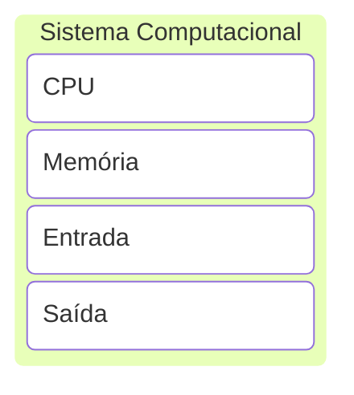

# {{ $slidev.configs.title }}
{{ $slidev.configs.description }}
{{ $slidev.configs.description }}
<logos-python />
---

# Objetivo de Aprendizagem
- Compreender os conceitos elementares da linguagem Python

---

# Agenda
- O que é Python?
- Elementos de um Sistema Computacional
- Variáveis
- Entrada / Saída

---
layout: section
---

# O que é Python?

---
layout: quote
---

# O que é Python?

> **Python** é uma linguagem de programação de alto nível, ou seja, com sintaxe mais simplificada e próxima da linguagem humana, utilizada nas mais diversas aplicações, como *desktop*, *web*, servidores e ciência de dados.

---
layout: quote
---

# O que é Python?

> Python foi lançado no início da década de 90 pelo programador e matemático holandês *Guido Van Rossum*. A linguagem foi projetada para dar ênfase no trabalho do desenvolvedor, facilitando a escrita de um código limpo, simples e legível, tanto em aplicações menores quanto em programas mais complexos.

---

# Por que Python?

- Versátil
- Fácil de aprender
- Código aberto
- Documentação disponível
- Largamente adotada [Stack Overflow Survey](https://survey.stackoverflow.co/2025/technology#most-popular-technologies-language-prof)

---
layout: section
---

# Sistema Computacional

---

# Sistema Computacional
Elementos

<div class="place-content-center">


</div>

---

# Memória

- As linguagens de programação utilizam a memória para armazenar informações através de **variáveis**
- Em Python não é diferente

---
layout: section
---

# Variáveis

---

# Variáveis
Conceito

- Uma variável é essencialmente um nome (etiqueta ou _label_) que é atribuído a um determinado valor
- Esse valor atribuído pode **mudar** durante a execução do programa
- Para otimizar o uso da memória as linguagens de programação classificam as variáveis em diferentes **tipos**

---

# Variáveis
Tipos

- Os tipos essenciais em qualquer linguagem são:
  - **string** (texto)
  - **integer** (números inteiros)
  - **floating point numbers** (números reais)
- Existem outros tipos de variáveis

---

# Variáveis
Regras para os nomes

- Apenas podem conter letras, números e (\_)
- Não podem começar com número
- São *case-sensitive* 
  - `myVar` $\neq$ `MyVar` $\neq$ `myvar`
- Comandos da linguagem não podem ser usados como nomes de variáveis, por exemplo `print`

---

# Exemplos
Nomes válidos

```python {*}{class: '!children:text-xl'}
age = 21
_colour = "lilac"
total_score = 90
```

---

# Exemplos 
Nomes inválidos


```python{*}{class:'!children:text-xl'}
1name = "Error"   # name1
class = 10        # class_
user-name = "Doe" # user_name
```

---
layout: two-cols-header
---

# Variáveis
Atribuição de valores

::left::

- Para atribuir valor a uma variável basta utilizar o operador `=`
- Exemplos:

::right::

```python{*}{class: '!children:text-xl'}
x = 5
y = 3.14
z = "Hi"
```

---
layout: quote
---

> Compreender as operações de Entrada/Saída (E/S) é fundamental para o aprendizado de linguagens de programação.

---
layout: two-cols-header
---

# Saída de dados

::left::

- O comando básico para saída de dados em Python é o `print()`
- Permite mostrar texto, variáveis e expressões no console
- O exemplo ao lado exibe a `string` literal "Hello, world!" no console

::right::

```python {*}{class:'!children:text-xl'}
print("Hello, world!")
```

---

# Saída de dados
Exemplo 1

- O exemplo mostrado cria duas varáveis `name` e `age` e exibe os valores com etiquetas

```python {*}{class:'!children:text-xl'}
name = "Alice"
age = 30
print("Nome:", name, "Idade:", age)
```

---

# Saída de dados
Exemplo 2

- É possível fazer atribuições múltiplas
- É possível exibir múltiplas variáveis em um único `print`

```python {*}{class:'!children:text-xl'}
x, y, z = 1, 2.5, "Python"
print(x, y, z)
```

---

# Elementos de um Sistema Computacional


---

# Entrada de Dados
`input()`

- Desenvolvedores necessitam interagir com os usuários tanto para devolver resultados quanto para **coletar informações**
- Existem diversas formas de coletar informações do usuário: mouse, câmeras, sensores, etc
- A forma mais comum é usando o teclado
- Em Python o principal comando para ler informação do teclado é `input`

```python {*}{class:'!children:text-xl'}
val = input("Entre um valor: ")
print(val)
```

---

# Entrada de Dados

- É exibida uma mensagem ao usuário, conforme a `string`
- Quando o comando `input` é executado o programa é **bloqueado**  (pausado) até que o usuário entre com a informação
- A informação repassada pelo usuário é **sempre** convertida para `string`

```python {*}{class:'!children:text-xl'}
name = input('Qual seu nome?\n')
print(name)
```

---

# Exemplo 3
`type()`

```python {*}{class:'!children:text-xl'}
num = input ("Entre com um número :")
print(num)
name1 = input("Entre com um nome : ")
print(name1)
print ("Tipo do número", type(num))
print ("Tipo do nome", type(name1))
```

---
layout: statement
---

# Qual a diferença entre atribuir valor a uma variável e realizar entrada de dados via `input`?

---
layout: fact
---

# Exercícios

---

# 1

> Criar um *script* em Python para que o usuário se apresente informando seu nome, sobrenome e idade. Ao final, exiba uma mensagem contendo essas 3 informações dadas pelo usuário.

---

# 2

> Criar um *script* em Python que solicita ao usuário informar: Logradouro onde mora (Rua, Avenida, etc), número, cidade, estado e CEP. Depois, exiba uma mensagem formatada com todas essas informações similar ao exemplo a seguir.<br>
`Rua das Palmeiras, 123`<br>`Belo Horizonte/MG`<br>`30123-456`<br>

---

# Referências

- [Python.org](https://docs.python.org/3/contents.html)
- [Google Colaboratory](https://colab.google/)
- [Python Development On Your Android Device](https://pydroid.app/)

---
src: /snippets/end.md
src: /snippets/end.md
---

